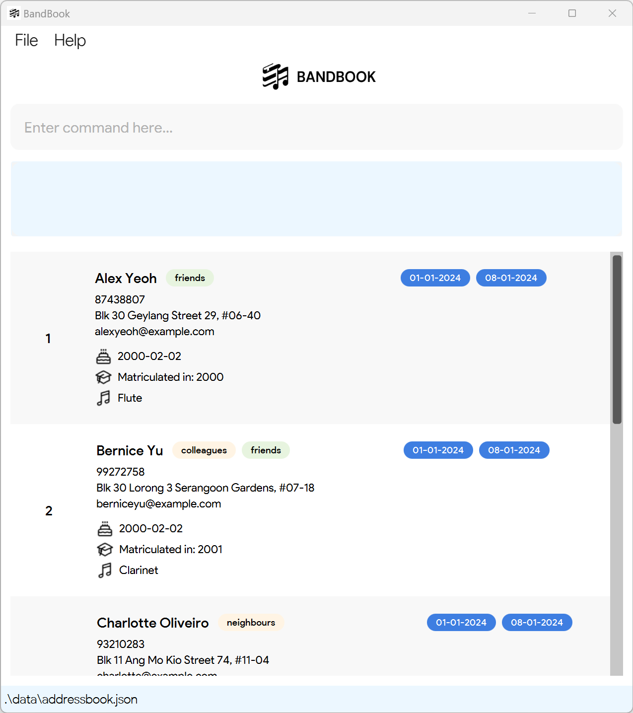

# BandBook User Guide

**Welcome to BandBook: Your Ultimate Band Management Software!**

BandBook is your all-in-one software designed to streamline the management of band members' contact details and
attendance. It offers a user-friendly platform to **add, edit and delete members' contact information**,
along with optional fields such as **tag, birthday, matriculation year and instrument information**.

Moreover, you can **assign instruments** to your members and **find your members by their name and/or instrument
assigned**. You may also **indicate and view the attendance history of your members**, ensuring that they stay on
track with the band's activities.

Optimised for use via a Command Line Interface (CLI), BandBook can assist you in managing your members' details
faster than traditional GUI apps.

Through this user guide, you will learn how to use BandBook effectively and efficiently. We will guide you through
step-by-step on how to use BandBook's features, along with the various commands available to you. Come on board and
unlock BandBook's full potential today!

<!-- * Table of Contents -->
<page-nav-print />

--------------------------------------------------------------------------------------------------------------------

## Quick start

1. Ensure you have Java `11` or above installed in your Computer.

2. Download the latest `BandBook-v1.4.jar` from [here](https://github.com/AY2324S2-CS2103T-T15-3/tp/releases).

3. Copy the file to the folder you want to use as the _home folder_ for BandBook.

4. Open a command terminal, `cd` into the folder you put the jar file in, and use the `java -jar BandBook-v1.4.jar`
   command to run the application. 
     A GUI similar to the below should appear in a few seconds. Note how the app contains some sample data. 
         

5. Type the command in the command box and press Enter to execute it. e.g. typing **`help`** and pressing Enter will
   open the help window.  

   Some example commands you can try:

   * `list` : Lists all contacts.

   * `add n/John Doe p/98765432 e/johnd@example.com a/John street, block 123, #01-01` : Adds a contact named `John Doe` to BandBook.

   * `delete 3` : Deletes the 3rd contact shown in the current list.

   * `clear` : Deletes all contacts.

   * `exit` : Exits the app.

6. Refer to the [Features](#features) below for details of each command.

--------------------------------------------------------------------------------------------------------------------

## Features

<box type="info" seamless>

**Notes about the command format:** 

* Words in `UPPER_CASE` are the parameters to be supplied by the user. 
  e.g. in `add n/NAME`, `NAME` is a parameter which can be used as `add n/John Doe`.

* Items in square brackets are optional. 
  e.g `n/NAME [t/TAG]` can be used as `n/John Doe t/friend` or as `n/John Doe`.

* Items with `…`​ after them can be used multiple times including zero times. 
  e.g. `[t/TAG]…​` can be used as ` ` (i.e. 0 times), `t/friend`, `t/friend t/family` etc.

* Parameters can be in any order. 
  e.g. if the command specifies `n/NAME p/PHONE_NUMBER`, `p/PHONE_NUMBER n/NAME` is also acceptable.

* Extraneous parameters for commands that do not take in parameters (such as `help`, `list`, `exit` and `clear`) will be ignored. 
  e.g. if the command specifies `help 123`, it will be interpreted as `help`.

* If you are using a PDF version of this document, be careful when copying and pasting commands that span multiple lines as space characters surrounding line-breaks may be omitted when copied over to the application.
</box>

### Parameter Constraints
#### NAME: `n/`
> It refers to the **name** of the person.
* Only accepts alphanumeric characters and spaces.
* Non-alphanumeric symbols and characters are not allowed.
* Case sensitive, i.e. John Doe ≠ john doe.
* No two persons can have the exact same name. It is recommended to enter full contact names to avoid this duplication error.
* Leading and trailing spaces are automatically removed.

#### PHONE_NUMBER: `p/`
> It refers to the **phone number** of the person.
* Only accepts numbers.
* Alphabets, symbols (+, #) and any other non-numeric characters are not allowed.
* Must be at least 3 digits long with no spaces.
* All valid phone number lengths (any country) are accepted, country code included.

#### EMAIL: `e/`
> It refers to the **email** of the person.
* Must follow the format 'local-part@domain'.

#### ADDRESS: `a/`
> It refers to the **address** of the person.
* Accepts any characters.

#### BIRTHDAY: `b/`
> It refers to the **birthday** of the person.
* Must be a valid date in the format YYYY-MM-DD.
* All dates from 0001-01-01 to the current date (inclusive) are accepted.

#### MATRICULATION_YEAR: `my/`
> It refers to the **matriculation year** of the person.
* Must be in the format YYYY.
* All years from 0001 to the current year (inclusive) are accepted.

#### INSTRUMENT: `i/`
> It refers to the **instrument** assigned to the person.
* Only accepts alphanumeric characters and spaces. 
* Stores only one instrument per person.
* Once a person has an instrument assigned, subsequent edits will require the instrument field to be filled.

#### TAG: `t/`
> It refers to the **tag(s)** used to categorise the person.
* Only accepts alphanumeric characters.
* Case sensitive, i.e. NUS ≠ nus.
* A person can have any number of tags (including 0).
* Multiple tags can be specified. For example, `t/friend t/colleague`.
* Tags are coloured according to a hash function, which assigns the tag a colour among 5 colours in BandBook's colour palette.

#### DATE: `d/`
> It refers to the **date** of attendance.
* Must be a valid date in the format YYYY-MM-DD.

### Viewing help : `help`

Shows a message explaining how to access the help page.

Format: `help`

 

### Adding a person: `add`

Adds a person to BandBook.

Format: `add n/NAME p/PHONE_NUMBER e/EMAIL a/ADDRESS [b/BIRTHDAY] [my/MATRICULATION_YEAR] [i/INSTRUMENT] [t/TAG]…​`

* All parameter constraints listed above apply. Click [here](#parameter-constraints) for the list of parameter constraints.

Examples:
* `add n/John Doe p/98765432 e/johnd@example.com a/John street, block 123, #01-01`
* `add n/Betsy Crowe t/friend e/betsycrowe@example.com a/Brown Street p/1234567 t/neighbour`
* `add n/Sally Jane p/1234567 e/betsycrowe@example.com a/Blk 123 Smith Street b/2001-02-02`

 

### Listing all persons : `list`

Shows a list of all persons in BandBook.

Format: `list`

 

### Editing a person : `edit`

Edits an existing person in BandBook.

Format: `edit INDEX [n/NAME] [p/PHONE_NUMBER] [e/EMAIL] [a/ADDRESS] [b/BIRTHDAY] [my/MATRICULATION_YEAR] [i/INSTRUMENT] [t/TAG]…​`

* Edits the person at the specified `INDEX`. The index refers to the index number shown in the displayed person list. The index **must be a positive integer** 1, 2, 3, …​
* At least one of the optional fields must be provided.
* Existing values will be updated to the input values.
* When editing tags, the existing tags of the person will be removed i.e adding of tags is not cumulative.
* You can remove all the person’s tags by typing `t/` without specifying any tags after it.
> Note: Command is only effective on the currently displayed list. Ensure that the index you have called is relative to the list that is currently displayed.

Examples:
*  `edit 1 p/91234567 e/johndoe@example.com` Edits the phone number and email address of the 1st person to be `91234567` and `johndoe@example.com` respectively.
*  `edit 2 n/Betsy Crower t/` Edits the name of the 2nd person to be `Betsy Crower` and clears all existing tags.

 

### Finding person(s) by name and/or instrument: `find`

Finds persons whose name and/or instrument fields contain any of the given keywords.

Format: `find [n/KEYWORD [MORE_KEYWORDS]] [i/KEYWORD [MORE_KEYWORDS]]`

* The search is case-insensitive. e.g `hans` will match `Hans`
* The order of the keywords does not matter. e.g. `Hans Bo` will match `Bo Hans`
* The contact detail field searched is based on the prefix provided.
* Only full words will be matched e.g. `Han` will not match `Hans`
* Persons matching at least one keyword will be returned (i.e. `OR` search).
  e.g. `Hans Bo` will return `Hans Gruber`, `Bo Yang`
* If a search yields 0 results, no persons will be listed.

Examples:
* `find n/John` returns `john` and `John Doe`
* `find n/alex david` returns `Alex Yeoh`, `David Li`
* `find n/alex david i/flute` returns `Alex Yeoh`, `David Li` and other persons who play the flute.
* `find i/clarinet flute` returns all persons who play the clarinet or flute.

 

### Deleting a person : `delete`

Deletes the specified person from BandBook.

Format: `delete INDEX`

* Deletes the person at the specified `INDEX`.
* The index refers to the index number shown in the displayed person list.
* The index **must be a positive integer** 1, 2, 3, …​
> Note: Command is only effective on the currently displayed list. Ensure that the index you have called is relative to the list that is currently displayed.

Examples:
* Entering `list`, followed by `delete 2` deletes the 2nd person in BandBook.
* Entering `find n/Betsy`, followed by `delete 1` deletes the 1st person in the results of the `find` command.

 

### Deleting person(s) by matriculation year: `delete my/[MATRICULATION_YEAR]`

Deletes persons with the specified matriculation year from BandBook.

Format: `delete my/[MATRICULATION_YEAR]`

* Deletes all persons who matriculated in year `MATRICULATION_YEAR`

Example:
* `delete my/2005` deletes all person(s) in BandBook who matriculated in 2005.

 

### Marking attendance of person(s): `att`

Marks the attendance the specified person(s) in BandBook.

Format: `att INDEX_1 [INDEX_2]... d/DATE`

* Marks the attendance of the person at the specified `INDEX`. The index refer to the index number shown in the displayed person list. The index **must be a positive integer** 1, 2, 3, ...
* At least one index must be provided.
* To specify multiple persons to mark an attendance for, specify each index with a space separating them apart.
* Each index refers to the index number shown in the displayed person list.
* The person's contact will be updated with a tag containing the attendance date marked.
* Duplicate entries of an attendance date for the same person are not supported.
> Note: Command is only effective on the currently displayed list. Ensure that the index you have called is relative to the list that is currently displayed.

Example:
* Entering `list`, followed by `att 1 2 d/2024-02-02` marks the attendance of the persons at the 1st and 2nd indexes of BandBook, on 2024-02-02.
* Entering `find n/David`, followed by `att 1 2 d/2024-02-02` marks the attendance of the persons at the 1st and 2nd indexes of the results of the `find` command, on 2024-02-02.
 

### Unmarking attendance of person(s): `attd`

Unmarks the attendance of the specified person(s) in BandBook.

Format: `attd INDEX_1 [INDEX_2]... d/DATE`

* Unmarks the attendance of the person(s) at the specified `INDEX`. The index refers to the index number shown in the displayed person list.
* The index **must be a positive integer** 1, 2, 3, ...
* At least one index must be provided.
* To specify multiple persons to unmark an attendance for, specify each index with a space separating them apart.
* The index refers to the index number shown in the displayed person list.
* The person must have already been marked present on the attendance date provided.
* The person's contact will be updated with the tag containing the date specified, removed.
> Note: Command is only effective on the currently displayed list. Ensure that the index you have called is relative to the list that is currently displayed.

Example:
* Entering `list`, followed by `attd 1 2 d/2024-02-02` unmarks the attendance of the persons at the 1st and 2nd indexes of BandBook, on 2024-02-02.
* Entering `find n/David`, followed by `attd 1 2 d/2024-02-02` unmarks the attendance of the persons at the 1st and 2nd indexes of the results of the `find` command, on 2024-02-02.

 

### Assigning an instrument to person(s): `assign`

Assigns an instrument to an existing person(s) in BandBook.

Format: `assign INDEX_1 [INDEX_2]... i/INSTRUMENT​`

* Assigns an instrument to the person(s) at the specified `INDEX`. The index refers to the index number shown in the displayed person list.
* The index **must be a positive integer** 1, 2, 3, …​
* At least one index must be provided.
* To specify multiple persons to assign an instrument to, specify each index with a space separating them apart.
* The index refers to the index number shown in the displayed person list.
* The instrument field will be updated with the input instrument which cannot be empty.
> Note: Command is only effective on the currently displayed list. Ensure that the index you have called is relative to the list that is currently displayed.

Examples:
*  `assign 1 i/Flute` Assigns the 1st person with the Flute instrument.
*  `assign 2 3 5 i/Clarinet` Assigns the 2nd, 3rd and 5th person with the Clarinet instrument.

 

### Clearing all entries : `clear`

Clears all entries from BandBook.

Format: `clear`

 

### Exiting the program : `exit`

Exits the program.

Format: `exit`

 

### Saving the data

BandBook data are saved in the hard disk automatically after any command that changes the data. There is no need to save manually.

 

### Editing the data file

BandBook data is saved automatically as a JSON file `[JAR file location]/data/bandbook.json`. Advanced users are welcome to update data directly by editing that data file.

<box type="warning" seamless>

**Caution:**
If your changes to the data file makes its format invalid, BandBook will discard all data and start with an empty data file at the next run.  Hence, it is recommended to take a backup of the file before editing it. 

Furthermore, certain edits can cause the BandBook to behave in unexpected ways (e.g., if a value entered is outside the acceptable range). Therefore, edit the data file only if you are confident that you can update it correctly.
</box>

 

### View Rehearsal Schedule `[coming in v2.0]`

_Details coming soon ..._

--------------------------------------------------------------------------------------------------------------------

## FAQ

**Q**: How do I transfer my data to another Computer? 
**A**: Install the app in the other computer and overwrite the empty data file it creates with the file that contains the data of your previous BandBook home folder.

--------------------------------------------------------------------------------------------------------------------

## Known issues

1. **When using multiple screens**, if you move the application to a secondary screen, and later switch to using only the primary screen, the GUI will open off-screen. The remedy is to delete the `preferences.json` file created by the application before running the application again.
  
2. **BandBook currently does not support users adding two contacts with the exact same name**. As such, it is recommended to enter full contact names to avoid running into this duplication error. Alternatively, modify the capitalisation of characters in the name to make them nonidentical (e.g `John Doe` & `john doe`).
  
3. **There is currently no data validation in place to verify that a contact's matriculation year comes after their birth year.** As such, do proceed with caution when entering data to ensure that it is entered accurately.  
  
We are currently working to resolve the above-mentioned issues, and expect to have fixes rolled out in the coming iterations of BandBook. We seek your kind understanding, and thank you for your continued support as we work towards better meeting your band administrator needs!
--------------------------------------------------------------------------------------------------------------------

## Command summary

Action     | Format, Examples
-----------|----------------------------------------------------------------------------------------------------------------------------------------------------------------------
**Add**    | `add n/NAME p/PHONE_NUMBER e/EMAIL a/ADDRESS [b/BIRTHDAY] [i/INSTRUMENT] [t/TAG]…​`   e.g., `add n/James Ho p/22224444 e/jamesho@example.com a/123, Clementi Rd, 1234665 t/friend t/colleague`
**Assign**  | `assign INDEX_1 [INDEX_2]... i/INSTRUMENT`   e.g. `assign 1 2 i/Flute`
**Attendance: Mark**  | `att INDEX_1 [INDEX_2]... d/DATE_IN_YYYY-MM-DD` e.g. `att 1 2 d/ 2024-02-02`
**Attendance: Unmark**  | `attd INDEX_1 [INDEX_2]... d/DATE_IN_YYYY-MM-DD`   e.g., `attd 1 2 d/2024-02-02`
**Clear**  | `clear`
**Delete by INDEX** | `delete INDEX`  e.g., `delete 3`
**Delete by MATRICULATION YEAR** | `delete my/MATRICULATION_YEAR`   e.g., `delete my/2005`
**Edit**   | `edit INDEX [n/NAME] [p/PHONE] [e/EMAIL] [a/ADDRESS] [b/BIRTHDAY] [i/INSTRUMENT] [t/TAG]…​`  e.g.,`edit 2 n/James Lee e/jameslee@example.com`
**Exit**   | `exit`
**Find**   | `find [n/KEYWORD [MORE_KEYWORDS]] [i/KEYWORD [MORE_KEYWORDS]]`  e.g., `find n/James Jake i/flute clarinet`
**List**   | `list`
**Help**   | `help`

--------------------------------------------------------------------------------------------------------------------

## Acknowledgements

BandBook is based on the AddressBook-Level3 project created by the [SE-EDU initiative](https://se-education.org).
It is a project under the CS2103T module, School of Computing, National University of Singapore.
